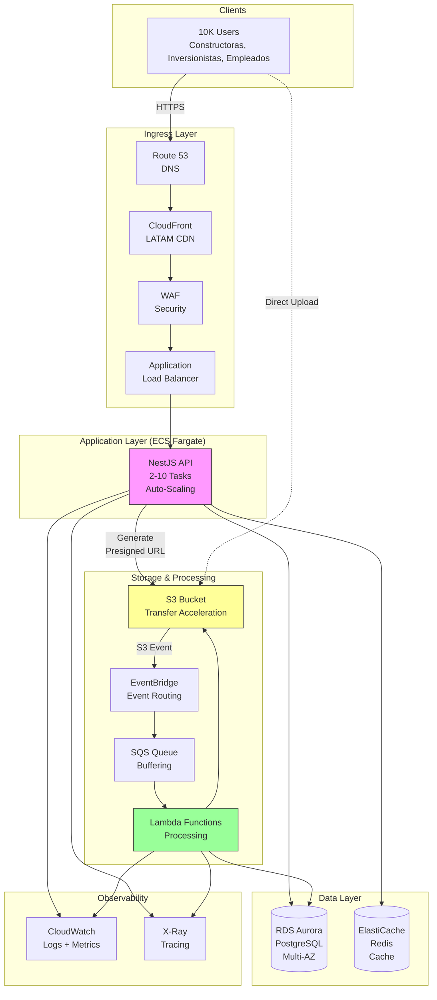
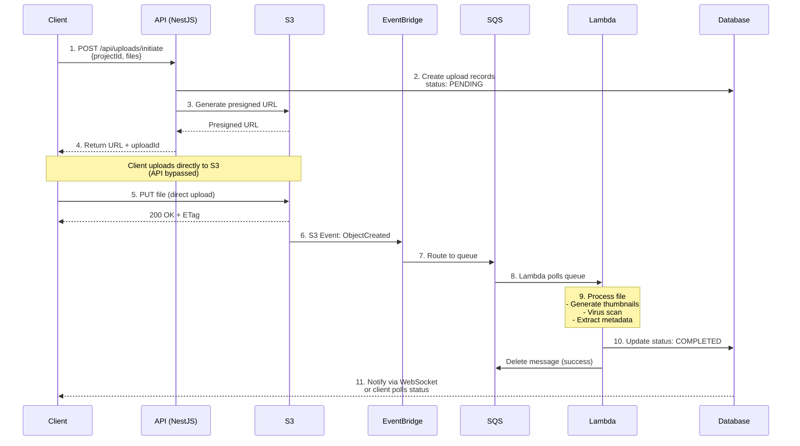
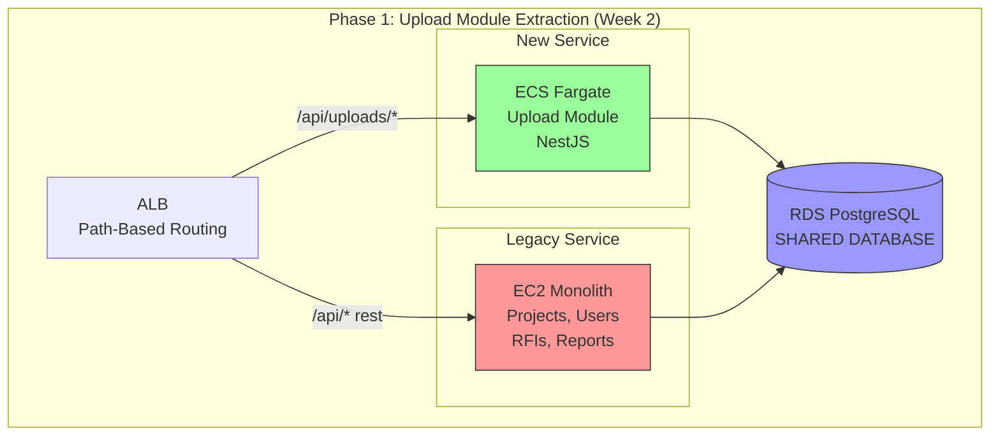

# Architecture Diagrams

This document contains the key diagrams referenced in the proposal, in both ASCII art and Mermaid format.

---

## Diagram 1: High-Level System Architecture

### ASCII Art Version

```
┌──────────────────────────────────────────────────────────────────┐
│                     CLIENTS (150 Constructoras)                  │
│  Constructoras | Inversionistas | Empleados de Obra (10K users) │
└────────────────────────────┬─────────────────────────────────────┘
                             │
                             │ HTTPS
                             │
┌────────────────────────────▼─────────────────────────────────────┐
│                        INGRESS LAYER                             │
│                                                                  │
│  Route 53 (DNS) → CloudFront (LATAM CDN) → WAF → ALB            │
│                                                                  │
└────────────────────────────┬─────────────────────────────────────┘
                             │
┌────────────────────────────▼─────────────────────────────────────┐
│                    APPLICATION LAYER (ECS Fargate)               │
│                                                                  │
│  ┌────────────────────────────────────────────────────────────┐ │
│  │            NestJS Monolithic Modular API                   │ │
│  │                                                            │ │
│  │  Auth | Users | Projects | UPLOADS★ | Documents | RFIs   │ │
│  │                                                            │ │
│  │  Auto-Scaling: 2-10 tasks (2 vCPU, 4 GB each)             │ │
│  └────────────────────────────────────────────────────────────┘ │
└────────────────────────────┬─────────────────────────────────────┘
                             │
┌────────────────────────────▼─────────────────────────────────────┐
│                         DATA LAYER                               │
│                                                                  │
│  ┌─────────────────────┐         ┌──────────────────────────┐   │
│  │  RDS Aurora         │         │  ElastiCache Redis       │   │
│  │  PostgreSQL         │         │  - Sessions              │   │
│  │  - Multi-AZ         │         │  - Upload status cache   │   │
│  │  - Read Replicas    │         │  - Rate limiting         │   │
│  └─────────────────────┘         └──────────────────────────┘   │
└──────────────────────────────────────────────────────────────────┘

┌──────────────────────────────────────────────────────────────────┐
│                   STORAGE & PROCESSING LAYER                     │
│                                                                  │
│  ┌──────────┐     ┌──────────────┐     ┌──────┐     ┌────────┐ │
│  │    S3    │────►│ EventBridge  │────►│ SQS  │────►│ Lambda │ │
│  │ Transfer │     │  (Routing)   │     │Queue │     │Process │ │
│  │  Accel   │     └──────────────┘     └──────┘     └────┬───┘ │
│  └──────────┘                                            │      │
│      │                                                   │      │
│      │ Presigned URLs                                    │      │
│      │ (Direct Upload)                              Update DB   │
│      │                                                   │      │
└──────┼───────────────────────────────────────────────────┼──────┘
       │                                                   │
       └───────────────────┬───────────────────────────────┘
                           │
                    ┌──────▼──────┐
                    │  CloudWatch │
                    │   X-Ray     │
                    │ (Observability)│
                    └─────────────┘
```

### Mermaid Diagram



---

## Diagram 2: Upload Flow (Sequence Diagram)

### ASCII Art Version

```
Client      API        S3       EventBridge   SQS     Lambda      DB
  │          │          │             │        │        │          │
  │ 1. POST  │          │             │        │        │          │
  │ /initiate│          │             │        │        │          │
  ├─────────►│          │             │        │        │          │
  │          │          │             │        │        │          │
  │          │ 2. Create│             │        │        │          │
  │          │   record │             │        │        │          │
  │          ├──────────┼─────────────┼────────┼────────┼─────────►│
  │          │          │             │        │        │    PENDING│
  │          │          │             │        │        │          │
  │          │ 3. Gen   │             │        │        │          │
  │          │   URL    │             │        │        │          │
  │          ├─────────►│             │        │        │          │
  │          │          │             │        │        │          │
  │◄─────────┤          │             │        │        │          │
  │  4. URL  │          │             │        │        │          │
  │          │          │             │        │        │          │
  │ 5. PUT   │          │             │        │        │          │
  │  file    │          │             │        │        │          │
  ├──────────┼─────────►│             │        │        │          │
  │          │          │             │        │        │          │
  │◄─────────┼──────────┤             │        │        │          │
  │  200 OK  │          │             │        │        │          │
  │          │          │             │        │        │          │
  │          │          │ 6. S3 Event │        │        │          │
  │          │          ├────────────►│        │        │          │
  │          │          │             │        │        │          │
  │          │          │             │ 7. Msg │        │          │
  │          │          │             ├───────►│        │          │
  │          │          │             │        │        │          │
  │          │          │             │        │ 8. Poll│          │
  │          │          │             │        ├───────►│          │
  │          │          │             │        │        │          │
  │          │          │             │        │        │ 9. Process│
  │          │          │             │        │        │    - Thumb│
  │          │          │             │        │        │    - Scan │
  │          │          │             │        │        │    - Meta │
  │          │          │             │        │        │          │
  │          │          │             │        │        │10. Update│
  │          │          │             │        │        ├─────────►│
  │          │          │             │        │        │  COMPLETE│
  │          │          │             │        │        │          │
  │          │          │             │        │◄───────┤          │
  │          │          │             │        │ Delete │          │
  │          │          │             │        │   Msg  │          │
  │          │          │             │        │        │          │
  │◄─────────┼──────────┼─────────────┼────────┼────────┼──────────┤
  │ 11. Notify (WebSocket/Polling)                       │          │
  │ "Upload Complete"                                     │          │
```

### Mermaid Sequence Diagram



---

## Diagram 3: Migration Phases

### ASCII Art Version

```
PHASE 1: Upload Module Extraction (Week 2)
┌─────────────────────────────────────────────┐
│        Application Load Balancer            │
│          (Path-Based Routing)               │
└──────────┬────────────────────┬─────────────┘
           │                    │
      /api/uploads/*       /api/* (rest)
           │                    │
  ┌────────▼─────────┐    ┌─────▼──────────┐
  │  ECS Fargate     │    │  EC2 Monolith  │
  │  (NEW)           │    │  (LEGACY)      │
  │  - Upload Module │    │  - Projects    │
  │  - NestJS        │    │  - Users       │
  │                  │    │  - RFIs        │
  └────────┬─────────┘    └─────┬──────────┘
           │                    │
           └────────┬───────────┘
                    │
          ┌─────────▼──────────┐
          │  RDS PostgreSQL    │
          │  (SHARED DATABASE) │
          └────────────────────┘

✅ Value: 10x upload throughput
✅ Rollback: Change ALB rule (30 seconds)
✅ Risk: Low (legacy still available)

════════════════════════════════════════════════

PHASE 2: Containerize Legacy (Week 3-4)
┌─────────────────────────────────────────────┐
│        Application Load Balancer            │
└──────────┬────────────────────┬─────────────┘
           │                    │
      /api/uploads/*       /api/* (rest)
           │                    │
  ┌────────▼─────────┐    ┌─────▼──────────┐
  │  ECS Fargate     │    │  ECS Fargate   │
  │  - Upload Module │    │  - Legacy Code │
  │                  │    │  (containerized)│
  │                  │    │  - Projects    │
  │                  │    │  - Users, etc  │
  └────────┬─────────┘    └─────┬──────────┘
           │                    │
           └────────┬───────────┘
                    │
          ┌─────────▼──────────┐
          │  RDS PostgreSQL    │
          └────────────────────┘

EC2 terminated ✅

✅ Value: Auto-scaling, zero-downtime deploys
✅ Rollback: ALB rule (if needed, EC2 backup kept 1 week)
✅ Risk: Low (same code, just containerized)

════════════════════════════════════════════════

PHASE 3: Fully Modular (Week 12)
┌─────────────────────────────────────────────┐
│        Application Load Balancer            │
└──────────┬────────────────────┬─────────────┘
           │                    │
           └────────┬───────────┘
                    │
          ┌─────────▼──────────┐
          │   ECS Fargate      │
          │                    │
          │  ┌──────────────┐  │
          │  │ NestJS       │  │
          │  │ Monolith     │  │
          │  │ (MODULAR)    │  │
          │  │              │  │
          │  │ ┌──────────┐ │  │
          │  │ │ Auth     │ │  │
          │  │ │ Users    │ │  │
          │  │ │ Projects │ │  │
          │  │ │ Uploads  │ │  │
          │  │ │ RFIs     │ │  │
          │  │ │ Reports  │ │  │
          │  │ └──────────┘ │  │
          │  └──────────────┘  │
          └────────┬───────────┘
                   │
          ┌────────▼───────────┐
          │  RDS PostgreSQL    │
          └────────────────────┘

✅ Value: Maintainable, modular codebase
✅ Future: Easy to extract modules to microservices if needed
✅ Risk: Low (internal refactoring, no user impact)
```

### Mermaid Diagram (Phase 1)



---

## Diagram 4: Multi-Tenancy Architecture

### ASCII Art Version

```
┌──────────────────────────────────────────────────────────┐
│                   150 TENANTS (Constructoras)            │
│                                                          │
│  Tenant A          Tenant B          Tenant C           │
│  (50 users)        (100 users)       (30 users)         │
└────────┬─────────────┬─────────────────┬────────────────┘
         │             │                 │
         │             │                 │
    ┌────▼─────────────▼─────────────────▼────┐
    │          Application (NestJS)            │
    │                                          │
    │  ┌────────────────────────────────────┐ │
    │  │  Tenant Middleware                 │ │
    │  │  - Extract tenant_id from JWT      │ │
    │  │  - Set DB context                  │ │
    │  │  - Validate access                 │ │
    │  └────────────────────────────────────┘ │
    └────────┬─────────────────────────────────┘
             │
    ┌────────▼─────────────────────────────────┐
    │      RDS PostgreSQL (Shared DB)          │
    │                                          │
    │  ┌────────────────────────────────────┐ │
    │  │  Row-Level Security (RLS)          │ │
    │  │                                    │ │
    │  │  uploads table:                    │ │
    │  │  ┌──────┬───────────┬──────────┐  │ │
    │  │  │ id   │ tenant_id │ filename │  │ │
    │  │  ├──────┼───────────┼──────────┤  │ │
    │  │  │ u1   │ tenant-A  │ plan.pdf │  │ │
    │  │  │ u2   │ tenant-B  │ foto.jpg │  │ │
    │  │  │ u3   │ tenant-A  │ rfi.doc  │  │ │
    │  │  └──────┴───────────┴──────────┘  │ │
    │  │                                    │ │
    │  │  POLICY tenant_isolation:          │ │
    │  │  WHERE tenant_id =                 │ │
    │  │    current_setting('app.tenant')   │ │
    │  └────────────────────────────────────┘ │
    └──────────────────────────────────────────┘

             │
    ┌────────▼─────────────────────────────────┐
    │           S3 Bucket Structure             │
    │                                          │
    │  /tenant-A/                              │
    │    /project-1/uploads/                   │
    │    /project-2/uploads/                   │
    │                                          │
    │  /tenant-B/                              │
    │    /project-1/uploads/                   │
    │    /project-2/uploads/                   │
    │                                          │
    │  /tenant-C/                              │
    │    /project-1/uploads/                   │
    │                                          │
    │  S3 Bucket Policy:                       │
    │  - IAM role can only access own prefix  │
    │  - Presigned URLs include tenant_id     │
    └──────────────────────────────────────────┘
```

---

## Diagram 5: Error Handling & Resilience

### ASCII Art Version

```
┌─────────────────────────────────────────────────────────┐
│                    ERROR SCENARIOS                      │
└─────────────────────────────────────────────────────────┘

SCENARIO 1: Network Failure During Upload
─────────────────────────────────────────────
Client            S3
  │                │
  ├───PUT part 1──►│ ✅ Success
  ├───PUT part 2──►│ ✅ Success
  ├───PUT part 3──X│ ❌ Network timeout
  │                │
  │ [Wait, retry]  │
  ├───PUT part 3──►│ ✅ Success (retry successful)
  ├───PUT part 4──►│ ✅ Success
  │                │
  └─Complete upload│ ✅ All parts uploaded

RESULT: ✅ Upload succeeds (multipart = resumable)

════════════════════════════════════════════════════════

SCENARIO 2: Lambda Processing Failure
─────────────────────────────────────────────
S3    EventBridge    SQS       Lambda      DB
 │         │          │          │          │
 ├─Event──►│          │          │          │
 │         ├─Route───►│          │          │
 │         │          ├─Deliver─►│          │
 │         │          │          │ ❌ Crash │
 │         │          │          │  (OOM)   │
 │         │          │          │          │
 │         │          │ [Visibility timeout: 5 min]
 │         │          │          │          │
 │         │          ├─Redeliver (Attempt 2)
 │         │          │         ►│          │
 │         │          │          │ ❌ Crash │
 │         │          │          │          │
 │         │          │ [Wait 5 min]         │
 │         │          │          │          │
 │         │          ├─Redeliver (Attempt 3)
 │         │          │         ►│          │
 │         │          │          │ ✅ Success│
 │         │          │          ├─────────►│
 │         │          │          │  Update  │
 │         │          │◄─Delete──┤          │
 │         │          │   Msg    │          │

RESULT: ✅ Eventually succeeds (SQS retry logic)

If all 3 attempts fail → DLQ → Ops team investigates

════════════════════════════════════════════════════════

SCENARIO 3: Database Connection Failure
─────────────────────────────────────────────
API           RDS Primary    RDS Standby
 │                │              │
 ├───Query───────►│ ❌ Down      │
 │                │              │
 │ [Connection timeout]          │
 │                │              │
 │                │ [Automatic failover: 60 sec]
 │                │              │
 │                X              │
 │                           ┌───▼──┐
 │                           │ Now  │
 │                           │Primary│
 │                           └───┬──┘
 │ [Retry query]                │
 ├───Query──────────────────────►│
 │                                │ ✅ Success
 │◄───────────────────────────────┤

RESULT: ✅ Succeeds after failover (Multi-AZ + retry)

════════════════════════════════════════════════════════

SCENARIO 4: S3 Unavailable (Region Issue)
─────────────────────────────────────────────
Client      API        S3
  │          │          │
  ├─Request─►│          │
  │  upload  │          │
  │          ├─Generate │
  │          │   URL   ►│ ❌ S3 API error
  │          │          │  (503 Service Unavailable)
  │          │          │
  │          │ [Circuit breaker opens]
  │          │          │
  │◄─────────┤          │
  │  503     │          │
  │"Uploads temporarily unavailable"
  │"Try again in 5 minutes"
  │          │          │
  │ [Client UI shows banner]
  │ [User can still browse projects]

RESULT: ⚠️ Graceful degradation (user notified, no data loss)
```

---

## Usage Notes

- **ASCII diagrams**: Best for documentation, PRs, terminal display
- **Mermaid diagrams**: Renders nicely in GitHub, GitLab, Notion
- For presentations: Convert Mermaid to PNG using:
  - https://mermaid.live
  - https://kroki.io
  - CLI: `mmdc -i diagram.mmd -o diagram.png`

---

**All diagrams are referenced in the main proposal documents.**
