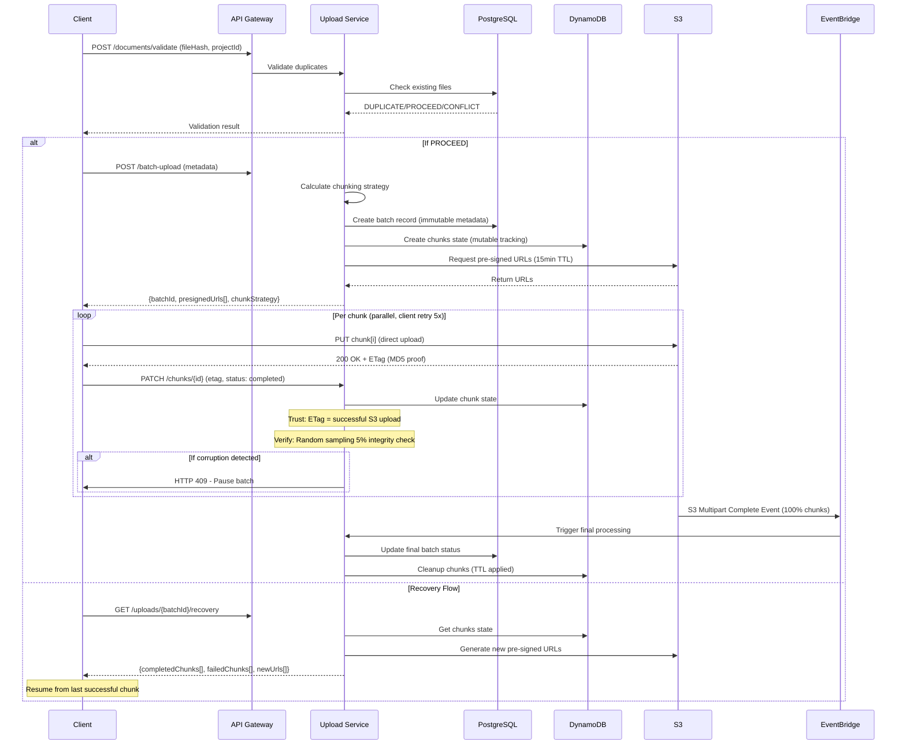

# Workflows Principales y Diseño de APIs**

## **4.1 Upload Workflow Detallado**

### **Flujo de Carga Masiva con Chunking Inteligente y Recovery**



### **Estrategia de Chunking**

| **Tamaño Archivo** | **Chunk Size** | **Paralelismo** | **Retry Strategy** | **Justificación** |
|-------------------|---------------|----------------|-------------------|-------------------|
| < 5MB | No chunking | 1 conexión | 3 reintentos, linear | Overhead innecesario |
| 5-100MB | 5MB chunks | 3 paralelas | 3 reintentos, exponential | Balance velocidad/estabilidad |
| 100MB-500MB | 10MB chunks | 5 paralelas | 5 reintentos, exponential+jitter | Optimizado para CAD/planos |
| > 500MB | 25MB chunks | 10 paralelas | 7 reintentos, circuit breaker | Máxima velocidad, resilencia |


## **4.2 API Design**

### **RESTful Endpoints - Upload Module**

| **Endpoint** | **Method** | **Purpose** | **Request/Response** | **SLA** |
|-------------|-----------|------------|---------------------|---------|
| `/documents/validate` | POST | Validar duplicados | **Request:**<br>`{fileHash: "sha256...", projectId: "proj-123", fileName: "plano.dwg"}`<br>**Response:**<br>`{result: "DUPLICATE" | "PROCEED" | "CONFLICT", message?: "..."}` | < 1s |
| `/projects/{id}/documents/batch` | POST | Iniciar carga masiva | **Request:**<br>`{files: FileMetadata[], options: UploadOptions}`<br>**Response:**<br>`{batchId, presignedUrls[], chunkStrategy}` | < 2s |
| `/uploads/{batchId}/status` | GET | Estado del batch | **Response:**<br>`{progress: 75, completed: 750, total: 1000, errors: []}` | < 200ms |
| `/uploads/{batchId}/chunks/{chunkId}` | PATCH | Confirmar chunk | **Request:**<br>`{status: "completed", etag: "d41d8cd98f00b204e9800998ecf8427e"}`<br>**Response:**<br>`{acknowledged: true, progressPercentage: 47}` | < 500ms |
| `/uploads/{batchId}/recovery` | GET | Recovery state | **Response:**<br>`{canResume: true, completedChunks: [1,2,3], failedChunks: [], newPresignedUrls: [...]}` | < 2s |
| `/documents/{id}` | GET | Obtener documento | **Response:**<br>`{metadata, downloadUrl, thumbnailUrl}` | < 1s |
| `/documents/{id}/versions` | GET | Historial versiones | **Response:**<br>`{versions: [{version, date, author, changes}]}` | < 2s |
| `/documents/search` | POST | Búsqueda avanzada | **Request:**<br>`{filters, query, pagination}`<br>**Response:**<br>`{results[], totalCount, nextToken}` | < 3s |


### **Idempotencia y Versionado**

```yaml
Idempotency Strategy:
- Header: X-Idempotency-Key (UUID)
- TTL: 24 horas en Redis
- Deduplication: SHA-256 de request body
- Response: Cached si key existe

API Versioning:
- Strategy: URL path versioning
- Current: /api/v1/
- Deprecated: 6 meses notice
- Sunset: 12 meses support

Rate Limiting:
- Per tenant: 1000 req/s burst, 500 req/s sustained
- Per endpoint customization:
  - Upload initiation: 100/min
  - Status checks: 1000/min
  - Search: 10/s
- Headers: X-RateLimit-Remaining, X-RateLimit-Reset
```

### **Error Handling Estándar**

| **HTTP Code** | **Error Type** | **Retry Strategy** | **Example Response** |
|--------------|---------------|-------------------|---------------------|
| 400 | ValidationError | No retry | `{error: "INVALID_FILE_FORMAT", message: "CAD file corrupted"}` |
| 401 | AuthenticationError | Refresh token | `{error: "TOKEN_EXPIRED", message: "Please authenticate"}` |
| 403 | AuthorizationError | No retry | `{error: "INSUFFICIENT_PERMISSIONS", message: "Project access denied"}` |
| 409 | ConflictError | Retry with new data | `{error: "VERSION_CONFLICT", message: "Document modified"}` |
| 429 | RateLimitError | Exponential backoff | `{error: "RATE_LIMITED", retryAfter: 60}` |
| 500 | InternalError | Retry 3x | `{error: "INTERNAL_ERROR", traceId: "abc-123"}` |
| 503 | ServiceUnavailable | Circuit breaker | `{error: "SERVICE_UNAVAILABLE", retryAfter: 30}` |

