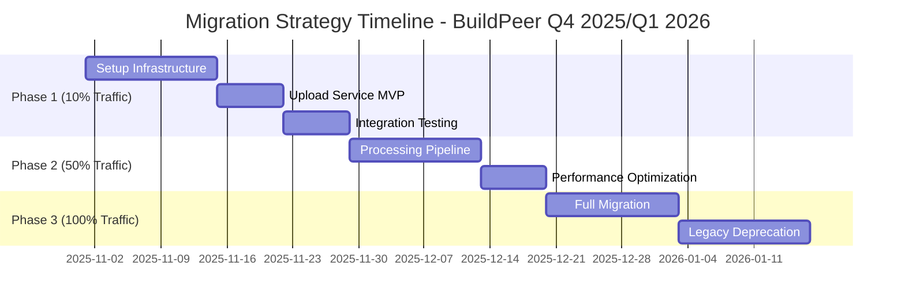

# Trade-offs y Decisiones Arquitectónicas**

## **5.1 Trade-offs Principales**

### **Decisión 1: Monolito Modular vs Microservicios Inmediatos**

| **Criterio** | **Monolito Modular** | **Microservicios** | **Peso** | **Decisión Final** |
|--------------|---------------------|-------------------|----------|-------------------|
| **Complejidad Operacional** | ⭐⭐⭐⭐⭐ Simple deployment, 1 servicio | ⭐⭐ Service mesh, múltiples deploys | 25% | **Modular gana** |
| **Time to Market** | ⭐⭐⭐⭐⭐ Setup rápido, menos overhead | ⭐⭐⭐ Setup complejo, más tiempo inicial | 30% | **Modular gana** |
| **Team Capacity** | ⭐⭐⭐⭐⭐ 4 devs pueden manejar | ⭐⭐ Requiere especialización k8s | 20% | **Modular gana** |
| **Escalabilidad Futura** | ⭐⭐⭐ Limitado por componente más pesado | ⭐⭐⭐⭐⭐ Scaling independiente | 15% | **Microservicios gana** |
| **Costo Operacional** | ⭐⭐⭐⭐ Menor overhead infraestructura | ⭐⭐ Service mesh, observability overhead | 10% | **Modular gana** |

**Score Ponderado:**
- **Monolito Modular**: 4.35/5
- **Microservicios**: 2.85/5

**Justificación de la Decisión:**
```yaml
Contexto Actual BuildPeer:
- Team: 6 developers (2 senior, 4 junior)
- Experiencia ECS/k8s: Limitada 
- Timeline: 10 semanas
- Budget constraint: Startup stage
- Growth stage: Escalando pero no masivo aún

Decisión: Monolito Modular
Razón: 
  1. Reduce risk de delivery fallido por complejidad
  2. Team puede manejar efectivamente
  3. Preparación natural para microservicios futuros
  4. 70% del valor con 30% de la complejidad

Migration Path: Modular → Microservicios (Q2 2026)
```

### **Decisión 2: Aurora PostgreSQL vs DynamoDB para Metadata**

| **Aspecto** | **Aurora PostgreSQL** | **DynamoDB** | **Impacto en BuildPeer** | **Winner** |
|-------------|----------------------|--------------|--------------------------|-----------|
| **Query Complexity** | SQL joins, agregaciones complejas | Key-value, queries limitadas | **Critical**: Reportes complejos construcción | **PostgreSQL** ✅ |
| **Consistency** | ACID, strong consistency | Eventually consistent (configurable) | **Important**: Aprobaciones documentos | **PostgreSQL** ✅ |
| **Scaling Pattern** | Vertical + Read replicas | Auto-scaling horizontal | **Medium**: Crecimiento gradual LATAM | **Empate** |
| **Operational Overhead** | Backup, tuning, monitoring | Fully managed | **Medium**: Team prefiere menos ops | **DynamoDB** |
| **Cost @ Scale** | $90-400/mes actual → $1,200/mes @ 15x | $4/mes → $200/mes @ 15x | **High**: Startup cost-sensitive | **DynamoDB** |
| **Team Expertise** | SQL expertise disponible | NoSQL learning curve | **High**: Faster development | **PostgreSQL** ✅ |


**Decisión Final: Aurora PostgreSQL**
- Las queries relacionales son **core business value**
- Team expertise acelera development  
- Costo incremental justificado por funcionalidad

### **Decisión 3: Compute Strategy - Híbrido ECS + Lambda**

| **Workload Type** | **ECS Fargate** | **Lambda** | **EC2** | **Decisión** | **Justificación** |
|-------------------|----------------|-----------|---------|-------------|------------------|
| **Upload API** | ✅ Seleccionado | ❌ 15min timeout limit | ❌ Overhead management | **ECS** | Long-running connections, WebSocket |
| **File Processing** | ❌ Cost inefficient | ✅ Seleccionado | ❌ Scaling complexity | **Lambda** | Event-driven, auto-scaling |
| **Sync Service** | ❌ Overkill | ✅ Seleccionado | ❌ Overhead | **Lambda** | Sporadic, lightweight |
| **Legacy Monolith** | ❌ Migration risk | ❌ Rewrite required | ✅ Seleccionado | **EC2** | Existing, stable |

**Hybrid Architecture Benefits:**
```yaml
Upload Service (ECS Fargate):
  - Persistent connections para chunked uploads
  - WebSocket support nativo
  - Predictable cost: $113/mes baseline
  - Auto-scaling: 1-10 tasks based on CPU/memory

Processing Pipeline (Lambda):  
  - Event-driven activation (S3 → EventBridge)
  - Scale-to-zero cuando no hay uploads
  - Cost-efficient: $5/mes para 30K processingos
  - Natural fit para Step Functions

Trade-off Aceptado:
  - Complejidad: 2 compute platforms vs 1
  - Beneficio: 60% cost reduction + better scaling
```

## **5.2 Estrategia de Migración**

### **Strangler Fig Pattern - 3 Fases**



**Timeline Resumen:**
- **Inicio**: 1 de Noviembre 2025
- **Fase 1 completa**: Diciembre 2025 (4 semanas)
- **Fase 2 completa**: Enero 2026 (3 semanas adicionales)
- **Migración 100%**: Marzo 2026 (4 semanas adicionales)
- **Duración total**: 11 semanas (~3 meses)

**Justificación del Timeline:**
- **Noviembre start**: Evita el período de menor actividad de fin de año
- **Q1 2026 completion**: Lista antes del pico de crecimiento proyectado Q2 2026
- **Buffer incluido**: 1 semana extra por fase para contingencias

### **Criterios de Rollback Automático**

| **Métrica** | **Threshold** | **Tiempo Sostenido** | **Acción** | **Recovery Time** |
|-------------|---------------|---------------------|------------|-------------------|
| **Latencia P95** | > 5 segundos | 2 minutos | Rollback automático | < 10 segundos |
| **Error Rate** | > 5% | 1 minuto | Circuit breaker → Fallback | < 5 segundos |  
| **Success Rate** | < 95% | 5 minutos | Gradual rollback 50%→0% | < 30 segundos |
| **Upload Failures** | > 10% | 30 segundos | Emergency rollback | < 5 segundos |

## **5.3 Consideraciones de Escalabilidad**

### **Auto-scaling Policies Detalladas**

#### **ECS Upload Service Auto-scaling**

```yaml
ECS Service Configuration:
  Min Tasks: 1
  Max Tasks: 8  
  Target CPU: 70%
  Target Memory: 80%
  
Scaling Policies:
  Scale Out:
    - Trigger: CPU > 70% for 2 minutes
    - Action: Add 2 tasks (max 8)
    - Cooldown: 300 seconds
    
  Scale In:  
    - Trigger: CPU < 30% for 10 minutes
    - Action: Remove 1 task (min 1)
    - Cooldown: 600 seconds
    
Custom Metrics:
  - Active WebSocket connections > 100
  - Upload queue depth > 50 items
  - Response time P95 > 2 seconds
```

#### **Lambda Concurrency Management**

| **Function** | **Reserved Concurrency** | **Provisioned** | **Justificación** |
|-------------|-------------------------|-----------------|-------------------|
| **ValidateFile** | 50 | 3 | High frequency, low latency required - 5K uploads/día baseline |
| **ProcessCAD** | 25 | 0 | CPU intensive, controlled parallelism - CAD files ~20% del volumen |  
| **ProcessMedia** | 75 | 5 | High volume, fast processing - Imágenes ~80% del volumen |
| **SyncHandler** | 15 | 2 | Occasional, user-facing - Real-time sync capability |

### **Database Scaling Strategy**

#### **Aurora PostgreSQL Multi-AZ Setup**

```yaml
Primary Instance: db.r6g.large (2 vCPU, 16GB)
  - Write operations
  - Critical reads (consistency required)
  
Read Replicas (5 instances):
  Replica 1: db.r6g.large - Reports & analytics
  Replica 2: db.t4g.medium - Document search  
  Replica 3: db.t4g.medium - API reads (projects)
  Replica 4: db.t4g.medium - API reads (documents) 
  Replica 5: db.t4g.small - Monitoring & backup queries

Connection Pooling:
  - PgBouncer: 100 max connections per replica
  - Application: 20 connections per service
  - Idle timeout: 10 minutes
```

### **Throttling y Rate Limiting**

#### **API Gateway Throttling**

| **Endpoint Pattern** | **Burst Limit** | **Rate Limit** | **Scope** | **Justificación** |
|---------------------|-----------------|---------------|-----------|-------------------|
| `/uploads/*` | 500 req/s | 100 req/s | Per project | Prevent S3 pre-signed URL abuse |
| `/documents/search` | 50 req/s | 10 req/s | Per user | Protect database from expensive queries |  
| `/batch/*` | 10 req/s | 5 req/s | Per project | Large batch operations are resource intensive |
| `/status/*` | 1000 req/s | 500 req/s | Per project | High frequency polling expected |
