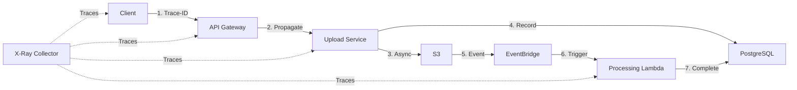

# **6. Observabilidad y Monitoreo**

## **6.1 Estrategia de Observabilidad Integral**

La observabilidad es crítica para mantener SLAs y detectar problemas proactivamente en un sistema distribuido de uploads masivos para BuildPeer. El challenge requiere que el sistema sea "observable" y "reliable".

### **Los Tres Pilares de Observabilidad**

| **Pilar** | **Implementación AWS** | **Purpose BuildPeer** | **Beneficio** |
|-----------|----------------------|----------------------|---------------|
| **Metrics** | CloudWatch Custom Metrics | Business KPIs + Infrastructure health | Proactive alerting & capacity planning |
| **Logs** | CloudWatch Logs + Structured JSON | Request tracing + Error debugging | Root cause analysis & audit trail |
| **Traces** | AWS X-Ray | End-to-end request journey | Performance optimization & bottleneck detection |

## **6.2 Métricas de Negocio y Técnicas**

### **Business KPIs (CloudWatch Custom Metrics)**

| **Métrica** | **Threshold** | **Alert Level** | **Business Impact** | **Action Required** |
|-------------|---------------|-----------------|-------------------|-------------------|
| **Upload Success Rate** | < 95% | 🚨 Critical | Revenue loss directo | Immediate rollback/fix |
| **Processing Time P95** | > 5 minutos | ⚠️ Warning | User experience degradation | Performance optimization |
| **File Corruption Rate** | > 0.1% | 🚨 Critical | Data integrity risk | Data validation review |
| **Recovery Success Rate** | < 98% | ⚠️ Warning | User frustration | Recovery UX improvement |
| **Daily Upload Volume** | Deviation > 30% | ℹ️ Info | Business trend monitoring | Capacity planning |

### **Infrastructure Metrics (Auto-collected)**

```yaml
ECS Upload Service:
  - CPU utilization (target: <70%)
  - Memory utilization (target: <80%) 
  - Task count (1-8 tasks)
  - Response time P95 (target: <2s)

Lambda Functions:
  - Invocation count & duration
  - Error rate (target: <1%)
  - Throttling incidents
  - Cold start frequency

Aurora PostgreSQL:
  - Connection count (<100 per replica)
  - Query performance (slow queries >1s)
  - Replica lag (<100ms)
  - Lock wait events

S3 & EventBridge:
  - Upload success/failure rates
  - Event processing latency
  - Dead letter queue depth
```

## **6.3 Distributed Tracing (AWS X-Ray)**

### **Trace Architecture**



### **Key Trace Patterns**

#### **1. Complete Upload Journey**
```yaml
Trace Name: "upload-journey"
Segments:
  1. API Gateway: /validate (duration: ~200ms)
  2. Upload Service: duplicate check (duration: ~300ms)
  3. PostgreSQL: metadata write (duration: ~50ms)
  4. S3: pre-signed URL generation (duration: ~100ms)
  5. Client: S3 direct upload (duration: varies 1s-10min)
  6. EventBridge: completion event (duration: ~10ms)
  7. Processing Lambda: validation + metadata (duration: 30s-5min)

Success Criteria: End-to-end < 10 minutes (CAD files)
```

#### **2. Error Propagation Trace**
```yaml
Trace Name: "error-recovery"
Error Scenarios:
  - Failed chunk upload → Retry logic → Success/Failure
  - Network timeout → Circuit breaker → Fallback response
  - Processing failure → Dead letter queue → Manual intervention

Correlation: traceId + batchId + chunkId for complete error context
```

### **Sampling Strategy**

| **Request Type** | **Sampling Rate** | **Justification** |
|------------------|-------------------|-------------------|
| **Large files (>500MB)** | 100% | High value, low volume, critical to trace |
| **Regular uploads (<50MB)** | 10% | High volume, statistical sampling sufficient |
| **Error responses** | 100% | Critical for debugging |
| **Recovery requests** | 100% | User experience critical |

## **6.4 Structured Logging Strategy**

### **Logging Standards**

#### **Log Format (JSON Structure)**
```json
{
  "timestamp": "2024-01-15T10:30:00Z",
  "level": "INFO|WARN|ERROR",
  "service": "upload-service|processing-service",
  "version": "v1.2.3",
  "traceId": "1-507f-1234567890123456",
  "correlationId": "batch-456-789",
  "userId": "user-12345",
  "projectId": "proj-67890",
  "event": "chunk_upload_completed",
  "metadata": {
    "chunkId": 5,
    "totalChunks": 100,
    "fileSize": "2.3GB",
    "uploadDuration": "45s",
    "retryCount": 1,
    "errorCode": null
  },
  "performance": {
    "dbQueryTime": "23ms",
    "s3OperationTime": "156ms"
  }
}
```

#### **Log Levels & Events**

| **Level** | **Events** | **Example Use Case** |
|-----------|------------|---------------------|
| **ERROR** | Upload failures, processing errors, database connection failures | `chunk_upload_failed`, `processing_timeout`, `db_connection_error` |
| **WARN** | Retry attempts, degraded performance, rate limiting | `chunk_retry_attempt`, `high_latency_detected`, `rate_limit_approached` |
| **INFO** | Successful operations, state changes, business events | `batch_created`, `upload_completed`, `user_recovery_initiated` |
| **DEBUG** | Detailed execution flow (disabled in production) | Internal function calls, variable states |

### **Log Retention & Storage**

```yaml
CloudWatch Log Groups:
  /buildpeer/upload-service:
    retention: 30 days
    estimated_cost: $150/mes (5K uploads/día)
  
  /buildpeer/processing-service:
    retention: 14 days  
    estimated_cost: $75/mes
  
  /buildpeer/api-gateway:
    retention: 7 days
    estimated_cost: $45/mes

Export Strategy:
  - Critical errors → S3 for long-term analysis
  - Audit events → Compliance archive (7 years)
  - Performance logs → Analytics pipeline
```

## **6.5 Dashboards y Alerting**

### **CloudWatch Dashboards**

#### **Executive Dashboard (Business View)**
```yaml
Widgets:
  1. Upload Success Rate (24h rolling) - Gauge
  2. Daily Upload Volume vs Target - Line chart  
  3. Revenue Impact ($) - Number
  4. Customer Satisfaction Score - Gauge
  5. System Availability (99.9% target) - Number
  6. Processing Backlog - Bar chart

Audience: CEO, CTO, Product Manager
Refresh: Real-time
Access: Public dashboard URL
```

#### **Operations Dashboard (Technical View)**
```yaml
Widgets:
  1. ECS Service Health (CPU, Memory, Tasks) - Multi-line chart
  2. Lambda Function Performance - Heat map
  3. Database Performance (queries/sec, connections) - Line chart
  4. S3 Operations (PUT/GET success rates) - Bar chart
  5. Error Rate by Service - Stacked area chart
  6. Active Incidents - Table

Audience: DevOps team, On-call engineers  
Refresh: 30 seconds
Access: Team dashboard with drill-down capabilities
```

#### **Debugging Dashboard (Incident Response)**
```yaml
Widgets:
  1. Recent Errors (last 1 hour) - Log insights query
  2. Failed Traces by Service - X-Ray service map
  3. Database Slow Queries - Table
  4. Lambda Cold Starts - Histogram
  5. Circuit Breaker States - Status grid
  6. Queue Depths (DLQ, retry) - Multi-line chart

Audience: Senior engineers, Incident commander
Refresh: 15 seconds  
Access: On-call rotation access only
```

### **Alerting Strategy**

#### **Critical Alerts (PagerDuty Integration)**

| **Alert** | **Condition** | **Escalation** | **Response SLA** |
|-----------|---------------|----------------|------------------|
| **Upload Success Rate < 95%** | 2 consecutive 5-min periods | Immediate → L2 in 15min | 5 minutes |
| **Service Unavailable** | Health check failures | Immediate → Manager in 30min | 2 minutes |
| **Data Corruption Detected** | File integrity validation fails | Immediate → CTO in 15min | 1 minute |
| **Processing Backlog > 1000** | Queue depth sustained >10min | L2 → L3 in 30min | 15 minutes |

#### **Warning Alerts (Slack Integration)**

| **Alert** | **Condition** | **Channel** | **Action Required** |
|-----------|---------------|-------------|-------------------|
| **Latency P95 > 5s** | 3 consecutive measurements | #engineering-alerts | Investigate within 1 hour |
| **Error Rate > 2%** | 10-minute sustained | #engineering-alerts | Monitor and investigate |
| **High Memory Usage** | >85% for 10 minutes | #devops-alerts | Scale out consideration |

## **6.6 Cost Analysis - Observabilidad**

### **Monthly Cost Breakdown (5K uploads/día)**

```yaml
CloudWatch Metrics:
  - Custom metrics (50 metrics × $0.30): $15/mes
  - API requests (dashboard loading): $8/mes
  
CloudWatch Logs:
  - Ingestion (15GB/mes × $0.50): $7.50/mes
  - Storage (30-day retention): $12/mes
  
X-Ray Tracing:
  - Traces recorded (50K/mes × $5 per 1M): $0.25/mes
  - Trace retrieval for debugging: $2/mes
  
PagerDuty Integration:
  - Professional plan for team (5 users): $129/mes

Total Observabilidad: ~$174/mes
Percentage of infrastructure cost: ~12%

ROI Justification:
- Average incident cost without proper monitoring: $15K
- Incidents prevented per month: 1-2
- Break-even: First prevented incident pays for monitoring for 7+ years
```

### **Scaling Cost Projections**

| **Volume** | **CloudWatch** | **X-Ray** | **Total/Month** | **Cost per Upload** |
|------------|----------------|-----------|-----------------|-------------------|
| **5K uploads/día** | $42.50 | $2.25 | $174 | $0.0035 |
| **15K uploads/día** (3x) | $67.50 | $6.75 | $203 | $0.0014 |
| **50K uploads/día** (10x) | $125 | $22.50 | $277 | $0.0006 |

**Observación**: Cost per upload decreases with scale due to fixed PagerDuty costs.