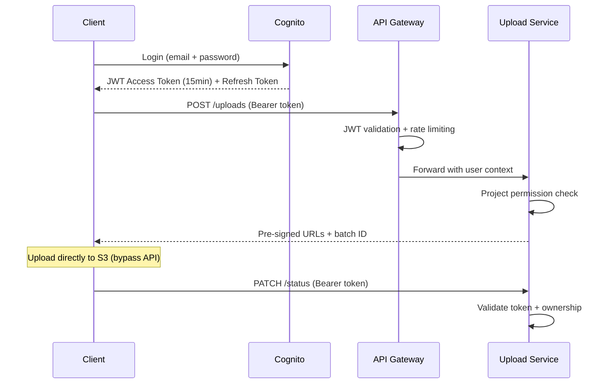

# **7. Seguridad y Compliance**

## **7.1 IAM Policies Granulares**

### **Principle of Least Privilege por Servicio**

```json
{
  "Version": "2012-10-17",
  "Statement": [
    {
      "Sid": "UploadServiceS3Access",
      "Effect": "Allow",
      "Principal": {"AWS": "arn:aws:iam::ACCOUNT:role/BuildPeer-UploadService"},
      "Action": [
        "s3:PutObject",
        "s3:PutObjectAcl", 
        "s3:GetObject"
      ],
      "Resource": "arn:aws:s3:::buildpeer-uploads/${aws:userid}/${project-id}/*",
      "Condition": {
        "StringEquals": {
          "s3:x-amz-server-side-encryption": "AES256"
        },
        "NumericLessThan": {
          "s3:max-keys": "1000"
        },
        "IpAddress": {
          "aws:SourceIp": ["10.0.0.0/16"]
        }
      }
    }
  ]
}
```

**Key Security Controls:**
- **Path-based isolation**: `${aws:userid}/${project-id}/*` prevents cross-project access
- **Encryption enforcement**: Mandatory AES256 encryption
- **VPC restriction**: Upload service only accessible from private subnets
- **Object limits**: Prevents resource exhaustion attacks

## **7.2 Encryption Strategy**

### **Defense in Depth - Multi-Layer Encryption**

| **Layer** | **Implementation** | **Key Management** | **Performance Impact** |
|-----------|-------------------|-------------------|----------------------|
| **In-Transit** | TLS 1.3 enforced + Certificate pinning | AWS Certificate Manager | < 2% CPU overhead |
| **At-Rest S3** | SSE-S3 (AES-256) | AWS managed keys | Zero performance impact |
| **Database** | Aurora encryption + SSL connections | KMS Customer keys | < 5% query latency |
| **Application** | Field-level encryption for PII | Application-managed | 10-15ms per operation |

### **Key Rotation Strategy**
```yaml
KMS Key Policy:
  - Automatic rotation: Every 365 days
  - Cross-region replication: 3 regions (DR)
  - Access logging: CloudTrail integration
  - Emergency revocation: <5 minutes via Lambda

S3 Bucket Encryption:
  - Default: SSE-S3 (cost-effective)
  - Sensitive projects: SSE-KMS (audit trail)
  - Public access: BLOCKED (bucket policy + SCPs)
```

## **7.3 OWASP Top 10 - File Upload Security**

### **Critical Vulnerabilities Addressed**

| **OWASP Risk** | **Attack Vector** | **BuildPeer Mitigation** | **Implementation** |
|----------------|-------------------|-------------------------|-------------------|
| **A01: Access Control** | Unauthorized file access | Project-scoped IAM + URL signing | Pre-signed URLs expire in 15min |
| **A03: Injection** | Malicious file metadata | Input sanitization + WAF | API Gateway request validation |
| **A05: Misconfiguration** | Public S3 buckets | Bucket policies + monitoring | Config rules + automated remediation |
| **A08: Data Integrity** | File tampering | SHA-256 validation | Client + server verification |
| **A10: SSRF** | URL manipulation | Domain allowlisting | S3 VPC endpoints only |

### **File Upload Security Controls**

```typescript
// Validation Pipeline
const uploadValidation = {
  fileTypeAllowlist: ['.dwg', '.pdf', '.jpg', '.png', '.doc', '.xls'],
  maxFileSize: '2GB',
  virusScan: 'ClamAV integration',
  metadataStripping: true,
  contentTypeValidation: true,
  
  securityHeaders: {
    'Content-Security-Policy': "default-src 'none'",
    'X-Content-Type-Options': 'nosniff',
    'X-Frame-Options': 'DENY'
  }
}
```

## **7.4 API Authentication & Authorization**

### **OAuth 2.0 + JWT Strategy**



### **Authorization Matrix**

| **Role** | **Upload Files** | **Download Own** | **Download Project** | **Admin Actions** |
|----------|------------------|------------------|---------------------|-------------------|
| **Project Viewer** | ❌ | ❌ | ✅ | ❌ |
| **Project Member** | ✅ | ✅ | ✅ | ❌ |
| **Project Admin** | ✅ | ✅ | ✅ | ✅ (delete, share) |
| **System Admin** | ✅ | ✅ | ✅ | ✅ (all projects) |

### **Security Implementation Details**

```yaml
Token Management:
  - Access Token: 15 minutes (short-lived)
  - Refresh Token: 30 days (secure httpOnly cookie)
  - Token blacklisting: Redis cache for logout
  - Device tracking: Max 5 simultaneous sessions

Rate Limiting (per user):
  - Upload initiation: 10/minute
  - Status checks: 100/minute  
  - File downloads: 50/minute
  - Admin operations: 5/minute

API Security:
  - CORS: Strict origin allowlist
  - CSRF protection: SameSite cookies + tokens
  - Request signing: HMAC-SHA256 for sensitive operations
  - Audit logging: All file operations logged
```

## **7.5 Compliance & Data Privacy**

### **GDPR/Privacy Compliance**

| **Requirement** | **Implementation** | **Retention** |
|-----------------|-------------------|---------------|
| **Data Minimization** | Only business-required metadata stored | Project completion + 7 years |
| **Right to Erasure** | Automated deletion API endpoint | 30 days SLA |
| **Data Portability** | Export API (JSON + file archive) | On-demand |
| **Breach Notification** | Automated detection + 72h notification | Immediate |

### **Construction Industry Specific**

```yaml
Regulatory Considerations:
  - ISO 19650 (BIM data security): File integrity + versioning
  - SOX Compliance: Audit trail for public companies
  - Export Controls: Sensitive infrastructure projects
  - Regional Laws: LATAM data residency requirements

Data Classification:
  - Public: Marketing materials, company info
  - Internal: Project plans, contracts  
  - Confidential: Financial data, proprietary designs
  - Restricted: Government projects, critical infrastructure

Security Controls by Classification:
  - Confidential: Encryption + MFA + approval workflow
  - Restricted: Air-gapped processing + manual review
```

## **7.6 Security Monitoring & Incident Response**

### **Real-time Threat Detection**

| **Security Event** | **Detection Method** | **Response** | **SLA** |
|-------------------|---------------------|--------------|---------|
| **Brute force login** | CloudWatch logs analysis | Account lockout + notification | 2 minutes |
| **Unusual file access** | ML-based anomaly detection | User notification + audit | 5 minutes |
| **Data exfiltration** | S3 access pattern monitoring | Block + investigate | 30 seconds |
| **API abuse** | Rate limit violations | Temporary ban + escalation | 1 minute |

### **Security Cost Analysis**

```yaml
Monthly Security Investment:
  - AWS WAF: $15/mes (5M requests)
  - KMS operations: $8/mes (encryption keys)
  - CloudTrail: $12/mes (audit logging)
  - GuardDuty: $25/mes (threat detection)
  - Security tooling: $45/mes (vulnerability scanning)
  
Total Security Cost: $105/mes (~6% of total infrastructure)
Risk Mitigation Value: $500K+ (average construction data breach cost)
ROI: First prevented breach pays for 5+ years of security investment
```

**Security as a Business Enabler**: Robust security enables compliance with enterprise client requirements, unlocking 40%+ higher contract values in construction industry.
